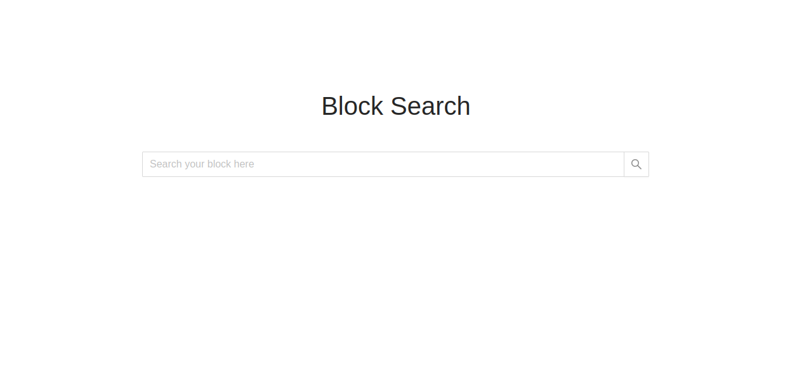
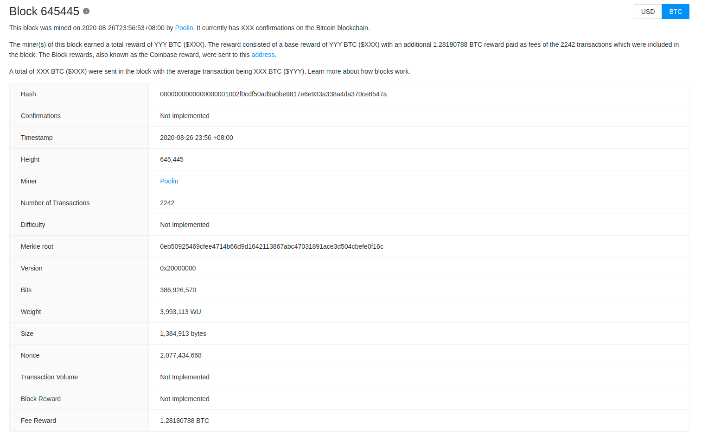
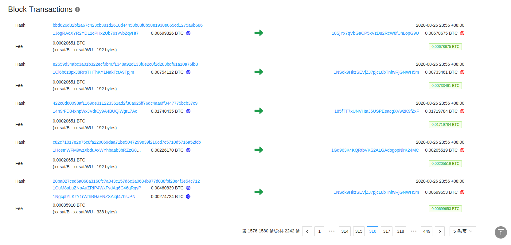

# 1. 概述

该项目实现区块的查询和展示，技术栈是`react17`。

- UI参考

https://www.blockchain.com/btc/block/00000000000000000007878ec04bb2b2e12317804810f4c26033585b3f81ffaa

- API

https://blockchain.info/rawblock/00000000000000000007878ec04bb2b2e12317804810f4c26033585b3f81ffaa

- API说明

https://www.blockchain.com/api/blockchain_api

# 2. 开发与发布

## 如何开发
```
$ node -v
v14.17.4
$ yarn install
$ yarn start
```

## 如何发布

- 生成发布包`build`，可以通过[nginx](https://hub.docker.com/_/nginx)部署到Production环境
```
$ yarn build
$ docker run -d --name block-search \
    -p 8080:80 \
    -v `pwd`/build:/usr/share/nginx/html:ro \
    nginx
```

- 生成`docker image`，并启动
```
$ yarn release
$ docker run -d -p 8080:80 shuzhang/block-search:0.1.0
```

## 如何测试

- 打开浏览器，访问`http://127.0.0.1:8080`
- 在搜索框输入`Block Height`或者`Block Hash`，例如645445，`回车`开始搜索
- 查看确认搜索结果




# 3. Next

由于时间原因，遗留一些工作，大部分与`区块链技术细节`相关，后续继续完善

- Block简介的一些数据，由于不清楚计算规则，暂未完成
- Block Header的一些字段，暂未填写，为`Not Implemented`状态
- Block Transactions的Fee数据未填写
- Block Transactions表格的自适应功能，暂未实现
- 法定货币和BTC转换的工作，尚未实现

项目优化的几个思路，可用于提高用户体验
- 支持更多区块链的检索，且不局限于区块，可支持交易、钱包地址等
- 支持更丰富的区块链数据报表，可从更多维度分析数据，图表形式会更加生动直接
- Search响应较慢，可以定时下载区块链公开数据到本地服务器，降低请求响应时长
- 前端的Transactions表格数据太大，影响用户体验，后端应开发分页API，支撑前端交互
